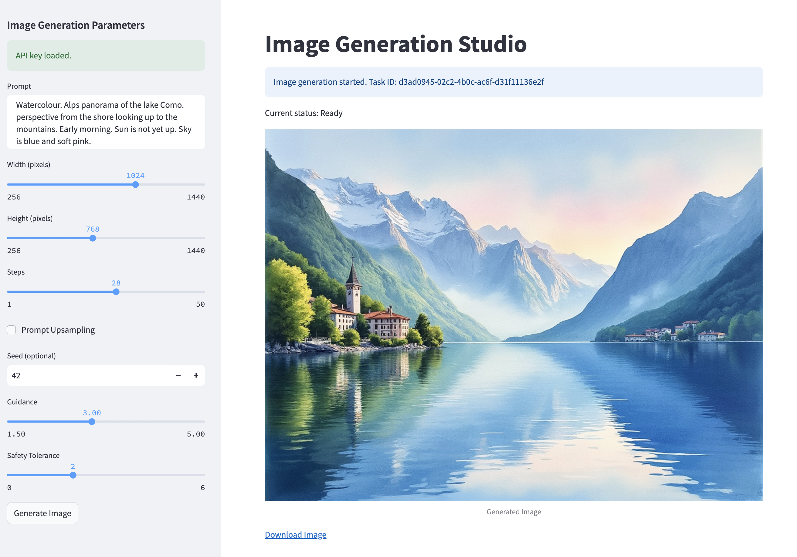

# Image Generation Studio

This is an exemplary implementation of a web application to generate images using an AI model.

This implementation uses Flux.1 for generating images and Streamlit as the UI web framework.



## Getting Started

Follow these instructions to set up and run the project on your local machine.

### Prerequisites

- Python 3.x
- Streamlit (`pip install streamlit`)
- Any other dependencies (e.g., `http.client`)

### Installation

1. Clone the repository:

    ```bash
    git clone https://github.com/your-username/image-generation-studio.git
    ```

2. Navigate to the project directory:

    ```bash
    cd image-generation-studio
    ```

3. Install the required Python libraries:

    ```bash
    pip install -r requirements.txt
    ```

### Running the Application

To run the Streamlit app locally:

```bash
streamlit run app.py
```

Note: The app will check for the presence of an API key in the .env file. If not found, it will prompt the user to input the API key within the UI.

## Generate images with Flux.1 [dev]

This Python implementation demonstrates how to call the Flux.1 API to generate images.

```python
import http.client

conn = http.client.HTTPSConnection("api.bfl.ml")

payload = "{\n  \"prompt\": \"ein fantastisches bild\",\n  \"width\": 1024,\n  \"height\": 768,\n  \"steps\": 28,\n  \"prompt_upsampling\": false,\n  \"seed\": 42,\n  \"guidance\": 3,\n  \"safety_tolerance\": 2\n}"

headers = {
    'Content-Type': "application/json",
    'X-Key': "YOUR_TOKEN"
}

conn.request("POST", "/v1/flux-dev", payload, headers)

res = conn.getresponse()
data = res.read()

print(data.decode("utf-8"))
```

## API Options

### Get the Result from Image Generation

An endpoint for retrieving the result of a generation task.

#### Query Parameters

- **id**: __(string, required)__ Task ID used for retrieving the result.

#### Responses

- **200**: **Successful Response** _(application/json, object)_
  - **id**: __(string, required)__ Task ID for retrieving the result.
  - **status**: __(string, required)__ Status of the task. Possible values include:
    - Task not found
    - Pending
    - Request Moderated
    - Content Moderated
    - Ready
    - Error
  - **result**: _(object or null)_ The generated image or `null` if not available.

- **422**: **Validation Error** _(application/json, object)_
  - **detail**: __(array of objects)__ List of validation errors.

### Generate Image

- **prompt**: __(string, required)__ Text prompt for image generation.
- **width**: __(integer, min: 256, max: 1440, default: 1024)__ Width of the generated image in pixels. Must be a multiple of 32.
- **height**: __(integer, min: 256, max: 1440, default: 768)__ Height of the generated image in pixels. Must be a multiple of 32.
- **steps**: __(integer, min: 1, max: 50)__ Number of steps for the image generation process.
- **prompt_upsampling**: __(boolean, default: false)__ Whether to perform upsampling on the prompt. If active, automatically modifies the prompt for more creative generation.
- **seed**: __(integer)__ Optional seed for reproducibility.
- **guidance**: __(float, min: 1.5, max: 5)__ Guidance scale for image generation. Higher values improve prompt adherence but may reduce realism.
- **safety_tolerance**: __(integer, min: 0, max: 6)__ Moderation tolerance level, with 0 being most strict and 6 being least strict.

### Task Status and Error Handling

The app supports polling for task status until completion. If an error occurs during image generation, detailed error messages from the API will be shown in the UI, allowing easier debugging and feedback. The task ID is saved in the session state and used to fetch the result.

## License

This project is licensed under the MIT License - see the LICENSE file for details.

## Acknowledgments

Flux.1 for the image generation model.
Streamlit for the UI framework.
